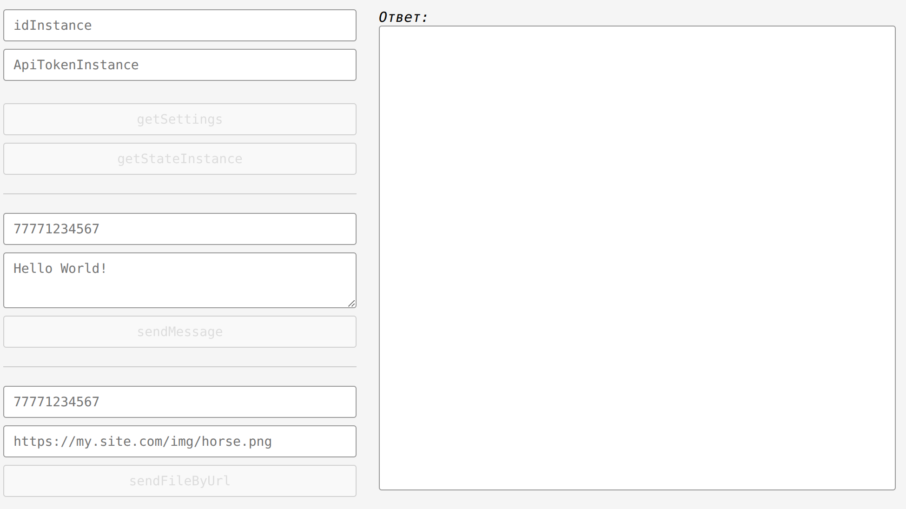
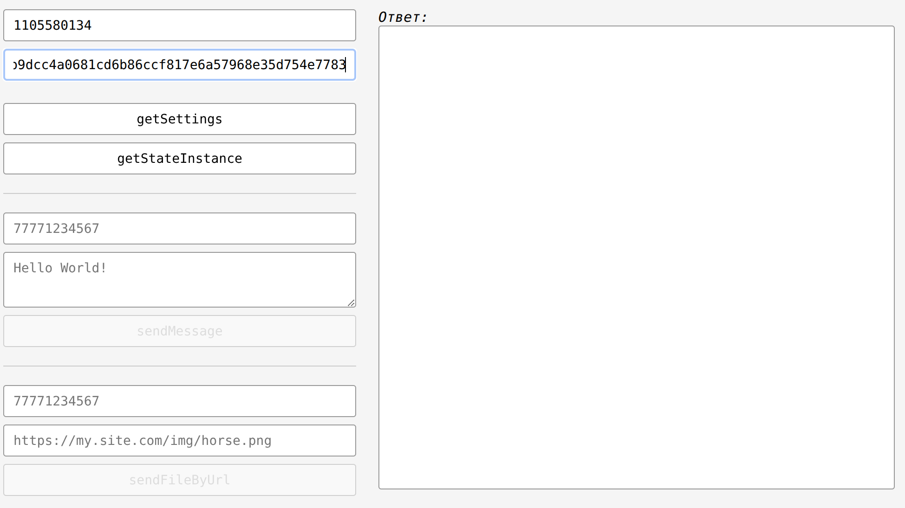
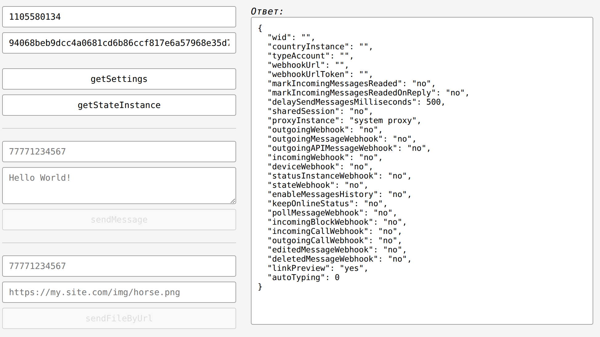
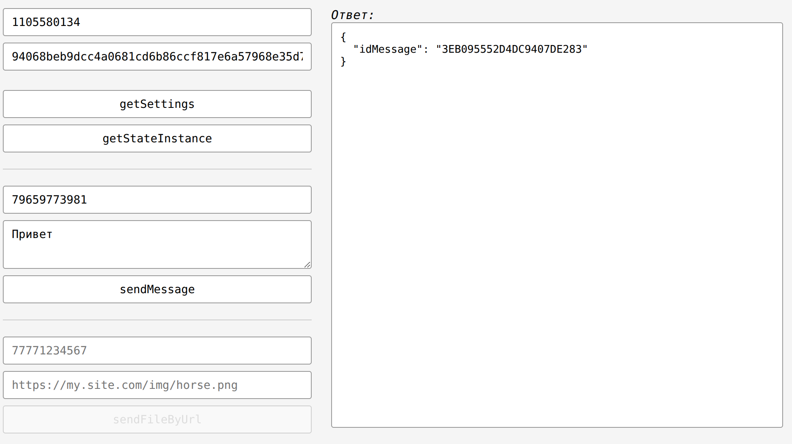

# WhatsApp API Tester

Single-page tool for testing Green API (WhatsApp).

## Пользователь заходит на страницу в Интернете

## вводит параметры подключения к инстансу - idInstance и ApiTokenInstance

## Пользователь последовательно нажимает на кнопки «getSettings»

## вводит номер телефона и текст сообщения и нажимает «sendMessage»

